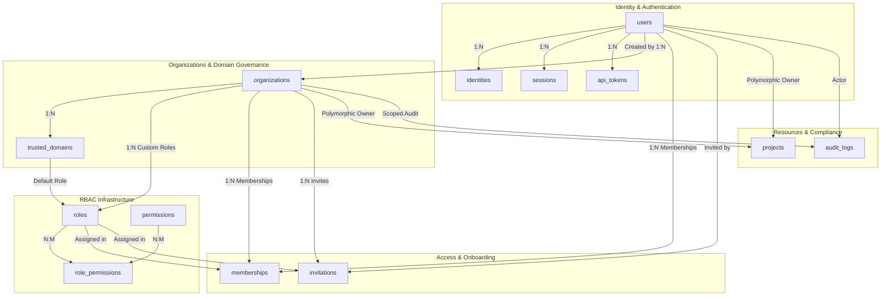
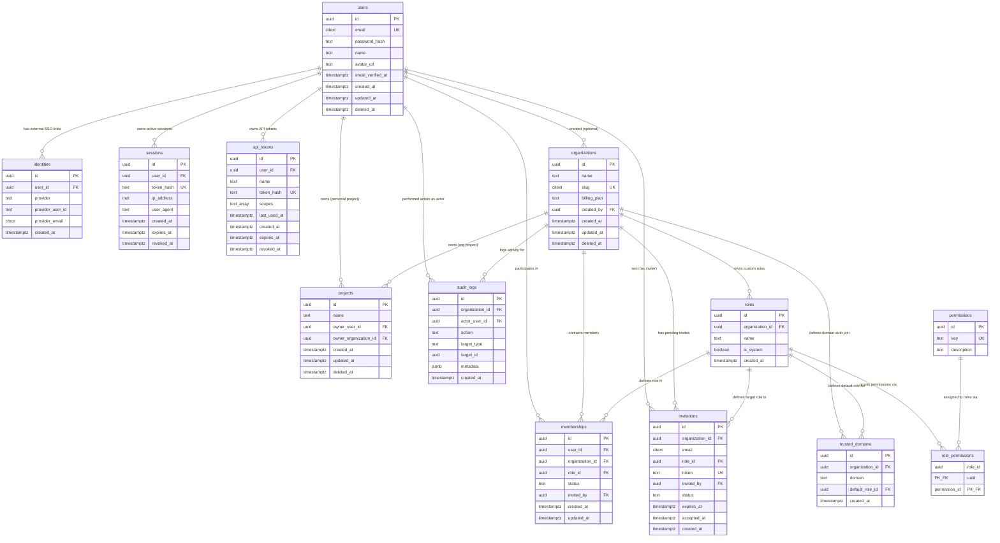

# Database Schema Diagram: Accounts, Organizations & RBAC

This visual Entity-Relationship (ER) diagram represents the complete database structure defined in [`accounts_orgs_schema.sql`](file:///c:/Users/Pablo/Documents/projects/learning-backend/accounts_orgs_schema.sql).

---

## High-Level Architectural Map

---

## Detailed Entity-Relationship (ER) Diagram

---

## Relationship Summary & Key Constraints

| Parent Table | Child Table | Relationship Type | Foreign Key Field | On Delete Behavior | Design Purpose / Constraint |
| :--- | :--- | :--- | :--- | :--- | :--- |
| `users` | `identities` | 1-to-Many | `user_id` | CASCADE | Allows multiple SSO auth providers (Google, GitHub) for one identity. |
| `users` | `sessions` | 1-to-Many | `user_id` | CASCADE | Active web sessions per user with explicit hash lookup and revocation. |
| `users` | `api_tokens` | 1-to-Many | `user_id` | CASCADE | Scoped API token access keys. |
| `users` | `organizations` | 1-to-Many | `created_by` | SET NULL | Tracks who originally created the organization without blocking org retention. |
| `organizations` | `trusted_domains` | 1-to-Many | `organization_id` | CASCADE | Domain auto-onboarding rules (`domain` + `organization_id` unique). |
| `roles` | `trusted_domains` | 1-to-Many | `default_role_id` | RESTRICT | Default role assigned to users auto-joined via matching email domain. |
| `organizations` | `roles` | 1-to-Many | `organization_id` | CASCADE | Null `organization_id` = global system role; non-null = custom org role. |
| `roles` | `role_permissions` | 1-to-Many | `role_id` | CASCADE | Join table connecting roles to permissions. |
| `permissions` | `role_permissions` | 1-to-Many | `permission_id` | CASCADE | Join table connecting permissions to roles. |
| `users` | `memberships` | 1-to-Many | `user_id` | CASCADE | Connects user identity to organization membership. |
| `organizations` | `memberships` | 1-to-Many | `organization_id` | CASCADE | Connects organization to user membership. |
| `roles` | `memberships` | 1-to-Many | `role_id` | RESTRICT | Defines user's active permissions inside that organization. |
| `organizations` | `invitations` | 1-to-Many | `organization_id` | CASCADE | Tracks invitations targeting an organization before membership creation. |
| `roles` | `invitations` | 1-to-Many | `role_id` | RESTRICT | Defines the pending role promised upon invitation acceptance. |
| `users` | `invitations` | 1-to-Many | `invited_by` | SET NULL | Tracks the inviting member. |
| `users` | `projects` | 1-to-Many (Polymorphic) | `owner_user_id` | CASCADE | Personal ownership of a project resource. |
| `organizations` | `projects` | 1-to-Many (Polymorphic) | `owner_organization_id` | CASCADE | Organizational ownership of a project resource. |
| `organizations` | `audit_logs` | 1-to-Many | `organization_id` | SET NULL | Scopes security audit log entries to an organization. |
| `users` | `audit_logs` | 1-to-Many | `actor_user_id` | SET NULL | Identifies the user executing the audited action. |

> [!NOTE]
> **Polymorphic Constraint in `projects`**: Enforced via PostgreSQL check constraint `chk_projects_single_owner`: `num_nonnulls(owner_user_id, owner_organization_id) = 1`. A project is owned strictly by a user OR an organization, never both and never neither.
